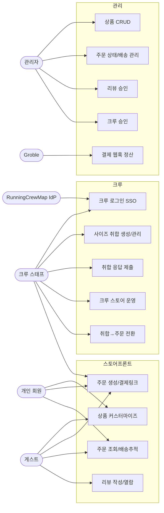

# 유스케이스 (Use Cases)

행위자(Actor)별 주요 유스케이스. 애플리케이션 레이어(`src/application/*`) 및 라우트와 매핑한다.

## 유스케이스 상세

| UC | 행위자 | 설명 | 진입점 / 서비스 |
|----|--------|------|-----------------|
| UC1 | 게스트/회원/크루 | 스튜디오에서 뷰별 이미지·텍스트 레이어로 굿즈 디자인 | `/studio/[productId]`, `product-service.getProductWithAreas` |
| UC2 | 게스트/회원/크루 | 장바구니→주문 생성, 외부 결제 링크 수령 | `/cart` → `POST /api/orders`, `order-service.createOrder` |
| UC3 | 게스트(전화)/회원 | 주문 상세·배송 추적 | `/order/[n]`, `/dashboard`, `/mypage/orders` |
| UC4 | 게스트 | 승인 리뷰 열람 / 주문번호로 작성 | `/gallery`, `/gallery/write` |
| UC5 | 크루 스태프 | RunningCrewMap SSO 로그인(리다이렉트/백채널 PIN) | `/api/sso/initiate`→`/sso/callback`, `actions/crew-login.ts` |
| UC6 | 크루 스태프 | 사이즈 취합 링크 생성·마감/재오픈 | `/collect/new`, `POST/PATCH /api/collections` |
| UC7 | 크루원(공개) | 이름·색상·사이즈·수량 제출(본인 수정) | `/collect/[token]`, `POST /api/collections/[token]/responses` |
| UC8 | 크루 스태프 | 크루 스토어에 디자인 상품 등록·공개 | `/api/store/register`, `/store/[storeToken]` |
| UC9 | 크루 스태프 | 취합 응답을 집계하여 주문 생성 | `/collect/[token]/manage`, `POST /api/collections/[token]/convert` |
| UC10 | 관리자 | 상품·이미지·커스터마이즈 영역 CRUD | `/admin/[t]/products`, `product-service` |
| UC11 | 관리자 | 주문 상태·메모·송장 관리 | `/admin/[t]/orders`, `order-service.updateOrderStatus/…` |
| UC12 | 관리자 | 리뷰 승인/거부 | `/admin/[t]/reviews`, `/api/reviews/[id]` |
| UC13 | 관리자 | crew_pending 승인/거부 | `/admin/[t]/crew-approvals`, `/api/admin/crew-approvals` |
| UC14 | Groble | 결제 완료 웹훅으로 주문 자동 정산 | `POST /api/webhooks/groble` |

흐름 상세는 [03-process/sequence.md](../03-process/sequence.md) 참고.
