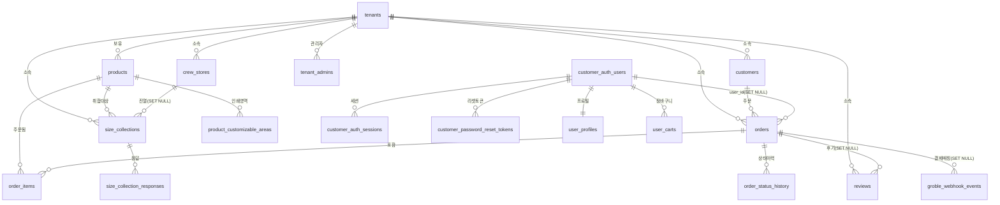

# 데이터 모델 — ERD

Postgres 스키마 `runhousecustom` (일부 크로스앱 테이블은 `public`). 근거:
`src/infrastructure/supabase/database.types.ts`, `supabase/migrations/003–008`, `docs/sql/custom-email-auth.sql`.

> 기반 테이블(tenants/products/orders/order_items/customers/user_profiles/user_carts)은 마이그레이션
> 001/002가 리포에 없어 `database.types.ts`에서 재구성했다.

## 참조 무결성 요약

- **CASCADE 삭제**: `tenant_admins`(테넌트), `size_collection_responses`(취합), `customer_auth_sessions`/`customer_password_reset_tokens`/`user_profiles`/`user_carts`(auth user).
- **SET NULL**: `orders.user_id`(auth user), `reviews.order_id`, `size_collections.product_id`/`store_id`, `groble_webhook_events.matched_order_id`.
- **UNIQUE**: `size_collections.token`/`admin_token`, `customer_auth_users.email`, `*_sessions.token_hash`, `used_sso_tokens.jti`(PK), `groble_webhook_events` 멱등키.

## 뷰 / 함수 / 열거형

- **뷰**: `order_list_view`(주문 목록 조회), `crew_stats`(크루 통계).
- **DB 함수**: `generate_order_number(p_tenant_id)`, `get_today_order_count(p_tenant_id)`.
- **Enum**: `order_status`(7), `review_status`(pending/approved/rejected), `user_type`(individual/crew_staff/crew_pending).

## RLS (Row Level Security)

`reviews`, `tenant_admins`, `size_collections`/`responses`, `groble_webhook_events`, `crew_stores`에 활성.
공통 패턴 = **Service role 전체 허용** + (reviews) anon은 approved SELECT / pending INSERT 허용.

테이블별 컬럼 상세는 [table.md](./table.md) 참고.
