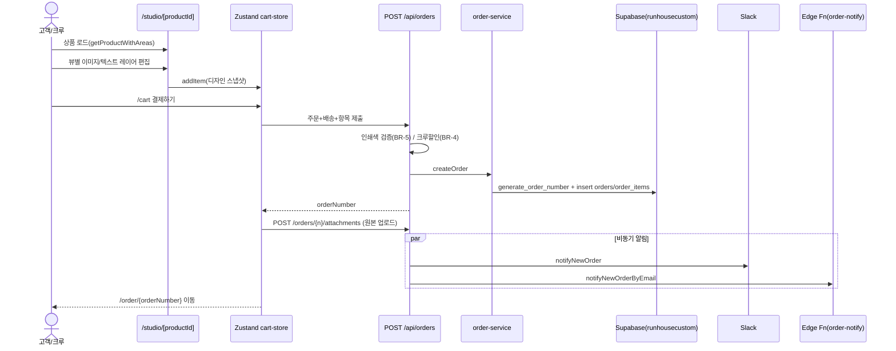
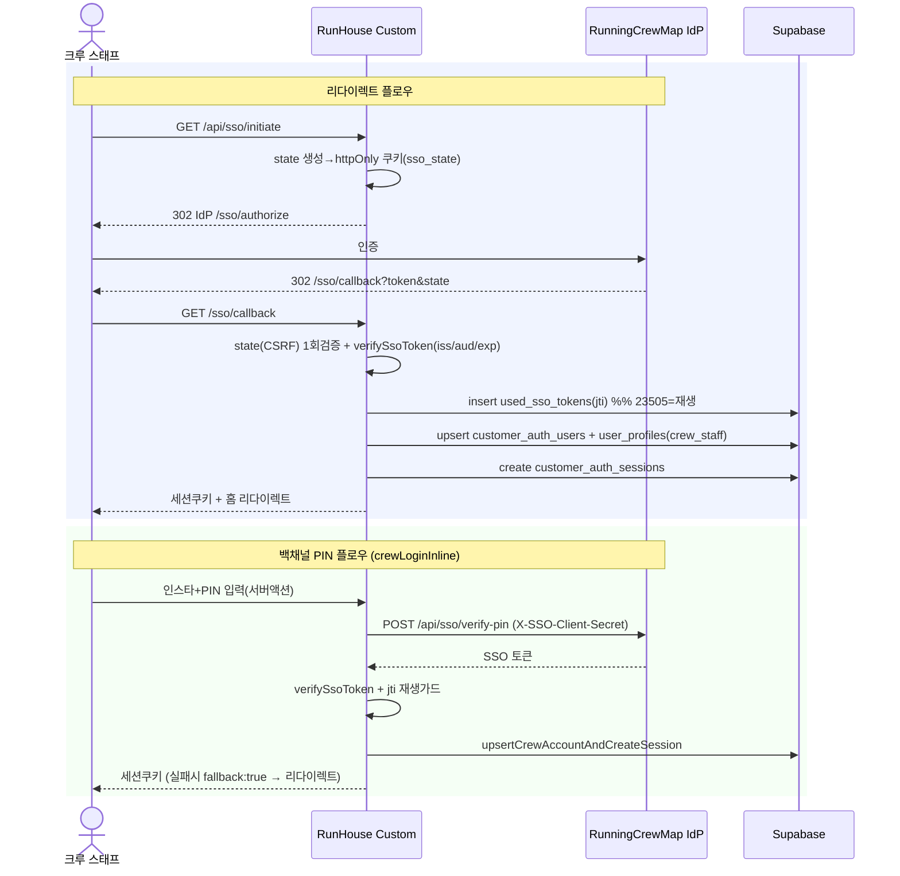
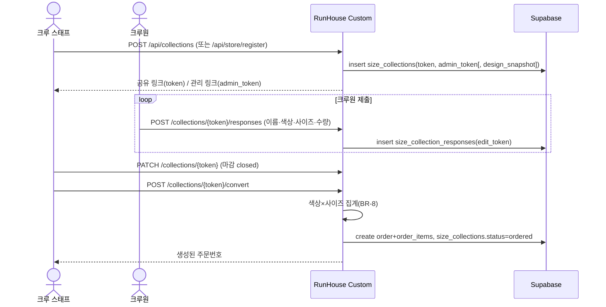
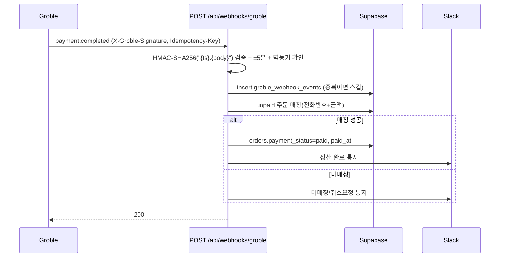

# 프로세스 뷰 — 주요 흐름 (Sequence)

동적 관점. 핵심 유스케이스의 런타임 상호작용을 시퀀스로 기술한다.

## 1. 커스터마이즈 → 주문 생성

## 2. 크루 SSO 로그인 (리다이렉트 + 백채널 PIN)

## 3. 크루 취합 → 주문 전환

## 4. Groble 결제 웹훅 정산

## 5. 관리자 인증 (참고)

관리자는 고객/크루와 분리된 JWT 세션(`admin_session`, jose HS256, 7일)을 사용하며
`/admin/[tenantSlug]/*` 접근 시 `getCurrentAdmin`으로 `session.tenantSlug === tenantSlug`를 검증한다.
근거: `src/lib/auth/admin-auth.ts`.
