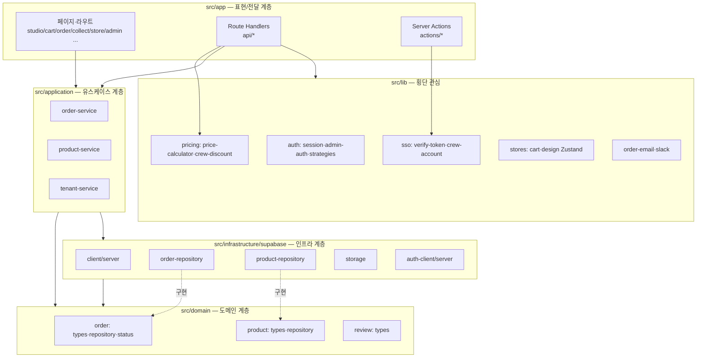

# C4 — Component (L3)

Next.js App 컨테이너 내부의 DDD 레이어와 주요 컴포넌트. 근거: `src/*`.

## 레이어 책임

| 레이어 | 경로 | 책임 | 의존 방향 |
|--------|------|------|-----------|
| 표현/전달 | `src/app` | 페이지 렌더, HTTP/액션 계약, 인증 강제 | → application, lib |
| 유스케이스 | `src/application` | 트랜잭션 스크립트(createOrder 등), `DEFAULT_TENANT_ID` | → domain, infrastructure |
| 도메인 | `src/domain` | 엔티티/VO/열거형/리포지토리 인터페이스, 규칙(진행률·주문번호) | 의존 없음(순수) |
| 인프라 | `src/infrastructure/supabase` | 리포지토리 구현, Supabase 클라이언트, 스토리지 | → domain |
| 횡단 | `src/lib` | 인증·SSO·가격·상태스토어·알림 | 부분 독립 |

## 의존성 규칙

- 도메인은 어떤 상위 레이어에도 의존하지 않는다(의존성 역전). 리포지토리는 **인터페이스는 domain, 구현은 infrastructure**.
- 애플리케이션 서비스는 리포지토리 싱글턴(`orderRepository`, `productRepository`)에 위임하고, 권한 필요 시 `.useServerClient()`(service-role)로 전환.
- 가격/할인(BR-3, BR-4)은 `src/lib/pricing`에 응집, 주문 API가 조립.

## 주요 클라이언트 컴포넌트

- **스튜디오**: `StudioClient` → `StudioLayout`/`OrderStyleStudioLayout`, `HatDesignCanvas`/`HatCanvas`(react-rnd), `ProductSidebar`.
- **상태**: `cart-store`·`design-store`(Zustand), `studio-context`.
- **분석**: `PostHogProvider`(layout에 주입).
