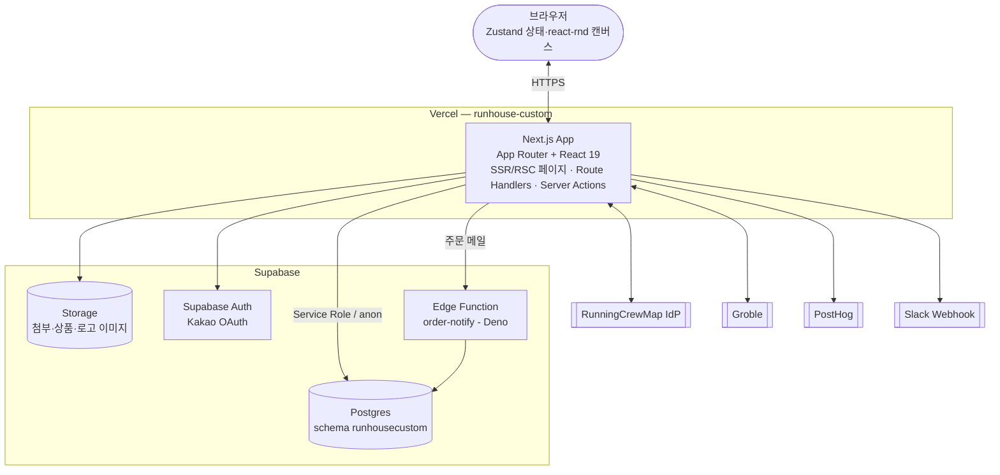

# C4 — Container (L2)

시스템 내부의 배포/실행 단위와 데이터 저장소.

## 컨테이너 목록

| 컨테이너 | 기술 | 책임 |
|----------|------|------|
| Next.js App | Next 16, React 19, TypeScript, Tailwind v4 | 페이지 렌더링(SSR/RSC), API 라우트, 서버액션, 인증/도메인 로직 |
| 브라우저 클라이언트 | Zustand(cart/design), react-rnd, next-themes | 스튜디오 캔버스, 장바구니, 클라이언트 상태 |
| Postgres | Supabase(schema `runhousecustom`) | 커머스·취합·인증 데이터, RLS, DB 함수/뷰 |
| Storage | Supabase Storage | 주문 첨부(.ai), 상품/로고 이미지 |
| Supabase Auth | Kakao OAuth | 소셜 로그인(콜백 `/auth/callback`). 고객 기본 인증은 커스텀 |
| Edge Function | Deno (`order-notify`) | 신규 주문 이메일 알림(비밀 헤더 인증) |

## 클라이언트 접근 계층 (Supabase)

`src/infrastructure/supabase/client.ts` — 스키마 `runhousecustom` 고정 3종:
- **browser client** (anon, `@supabase/ssr`) — 클라이언트 컴포넌트
- **server client** (anon) — 서버 렌더/라우트
- **service-role client** (RLS 우회, 세션 미유지) — 관리자·시스템 작업. 리포지토리 `.useServerClient()`로 전환

> 참고: `@prisma/client`와 docker-compose Postgres는 잔재이며 프로덕션 데이터스토어는 Supabase다.

컴포넌트(레이어) 내부 구조는 [c4-component.md](./c4-component.md), 배포는 [deployment.md](./deployment.md).
