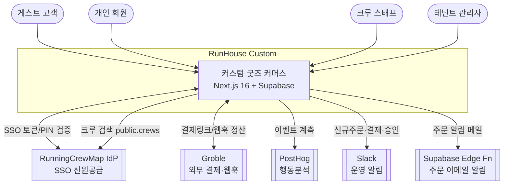

# C4 — System Context (L1)

RunHouse Custom 시스템과 외부 행위자·시스템의 경계를 보여준다.

## 경계 설명

- **시스템**: 러닝 크루 대상 멀티테넌트 커스텀 굿즈 커머스. 스튜디오 디자인 → 개별/크루 주문 → 배송추적.
- **RunningCrewMap IdP**: 크루 계정 인증. 리다이렉트 SSO + 백채널 PIN. 크루 마스터(`public.crews`) 공유.
- **Groble**: 자체 PG 대체. 주문별 외부 결제 링크 + `payment.completed` 웹훅으로 정산.
- **PostHog**: `/ingest`로 리버스 프록시된 행동 분석(스튜디오 오픈·주문 시작 등).
- **Slack / Email**: 운영 통지 채널(단방향).

컨테이너 분해는 [c4-container.md](./c4-container.md) 참고.
