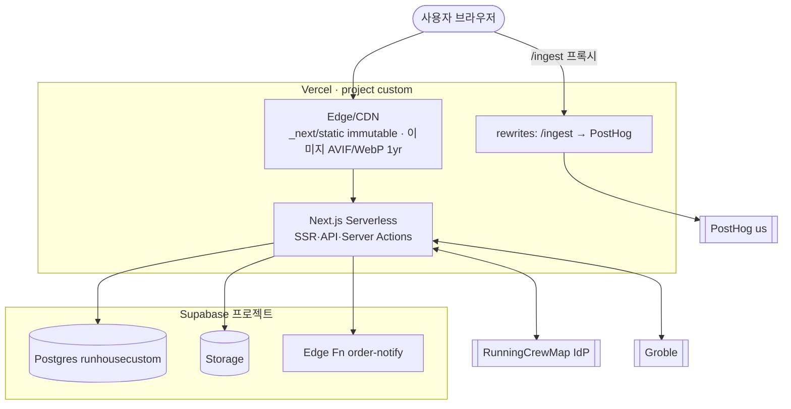

# 배포 뷰 (Deployment)

근거: `next.config.ts`, `.vercel/repo.json`, `docker-compose.yml`, `src/components/shared/PostHogProvider.tsx`.

## 배포 대상

- **호스팅**: Vercel. 프로젝트명 `custom`, 기본 호스트 `https://runhouse-custom.vercel.app`(`NEXT_PUBLIC_SITE_URL`로 오버라이드).
- **데이터**: Supabase(Postgres+Storage+Edge Fn). 이미지 원격 호스트 `*.supabase.co` 허용.
- **로컬 개발**: `docker-compose.yml`의 Postgres 16(`custom_hat_db`)은 로컬 전용, 프로덕션 아님.
- **스크립트**: `dev`/`build`/`start`/`lint`(Next 표준), E2E용 `playwright`(devDep).

## next.config 주요 설정

| 항목 | 값/목적 |
|------|---------|
| rewrites `/ingest/*` | PostHog 리버스 프록시(`us.i.posthog.com`, `us-assets`) |
| images | AVIF/WebP, 1년 캐시, Supabase remote pattern |
| headers | `/api/products` s-maxage 3600, `/_next/static` immutable |
| headers `/sso/*` | `Referrer-Policy: no-referrer` (토큰 유출 방지) |
| optimizePackageImports | `lucide-react` |
| skipTrailingSlashRedirect | 활성 |

## 환경변수 (핵심)

`NEXT_PUBLIC_SUPABASE_URL/_ANON_KEY`, `NEXT_PUBLIC_POSTHOG_KEY/_HOST`, `NEXT_PUBLIC_SITE_URL`,
`NEXT_PUBLIC_SSO_IDP_URL`, `RUNHOUSE_SSO_BACKCHANNEL_SECRET`, `RUNHOUSE_SSO_SECRET`,
`GROBLE_WEBHOOK_SECRET`(+`-previous` 로테이션), `SUPABASE_ORDER_NOTIFY_FUNCTION_URL`,
`ORDER_NOTIFY_FUNCTION_SECRET`, `ADMIN_SESSION_SECRET`/`JWT_SECRET`, Slack Webhook URL.

> 운영 접근 정보(Supabase 마이그레이션·Vercel 프로젝트·Groble 웹훅)는 별도 메모리에서 관리한다.
